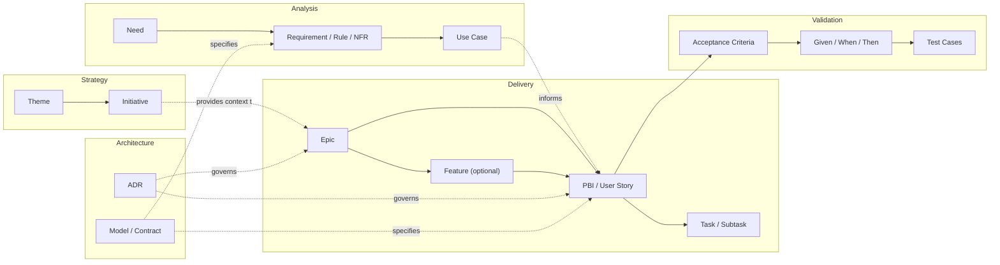
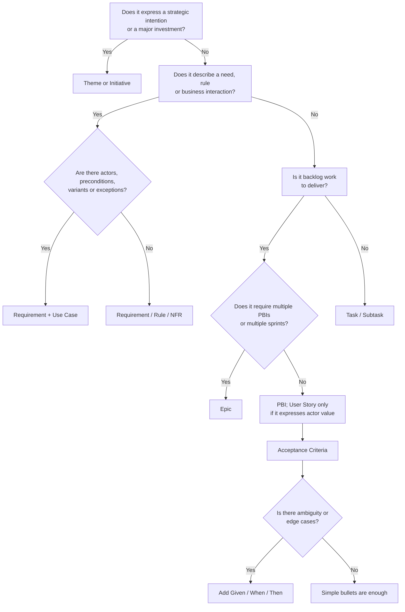

# Software Project Documentation

Guide for organizing software project documentation artifacts by disciplinary layers, avoiding rigid hierarchies and favoring traceability between artifacts.

## Core Idea

It is not advisable to force a single universal hierarchical chain for all artifacts. In a modern project, several worlds coexist with different artifacts and purposes. The recommendation is to organize artifacts **by discipline or layer** and relate them through **traceability**, not mandatory parenthood.

## Writing Guidelines

Durable documentation should be useful months after it was written. Before adding or changing artifacts, review [Writing Guidelines](/conventions/writing-guidelines) to align titles, tone, terminology, links, Markdown structure and examples.

Apply those rules especially when:

- adding navigation labels or section headings;
- creating templates that other repositories will copy;
- documenting business concepts, requirements or architecture decisions;
- writing examples that may be reused by people or AI agents.

## Disciplinary Layers

| Layer | Purpose | Questions it answers |
| --- | --- | --- |
| [Strategy](./strategy/) | Align investment, direction and product priorities | What outcome do we want to achieve? Why is it worth investing? |
| [Analysis](./analysis/) | Understand the problem, formalize needs and behavior | What does the business need? What must the system do? |
| [Architecture](./architecture/) | Document technical decisions, models and contracts | How will the solution be structured? What decisions are binding? |
| [Delivery](./delivery/) | Organize, prioritize and decompose work | What will be built? What enters the sprint? |
| [Validation](./validation/) | Ensure that what was delivered meets the expected conditions | How will we know this is done correctly? |

## General Model



## Decision Flow

Not sure what type of artifact to create? Use this flow:



## Folder Structure

A project documentation site should group the durable project layers under a `layers/` directory, instead of placing them directly at the root. Emojis in this example are visual cues, not part of the folder names.

```text
📂 project-docs/
├── 📁 .vitepress/
│   └── 📄 config.mts                  ← site navigation and sidebar registration
├── 📄 index.md                        ← project documentation home
├── 📁 layers/
│   ├── 📁 analysis/
│   │   ├── 📄 index.md                ← needs, requirements, use cases and rules
│   │   ├── 📁 business-rules/
│   │   │   └── 📄 ana-br-001-deposit-policy.md
│   │   ├── 📁 needs/
│   │   │   └── 📄 ana-ned-001-online-quote-access.md
│   │   ├── 📁 requirements/
│   │   │   └── 📄 ana-req-001-access-channels.md
│   │   └── 📁 use-cases/
│   │       └── 📄 ana-uc-001-request-quote.md
│   ├── 📁 architecture/
│   │   ├── 📄 index.md                ← decisions, contracts and technical models
│   │   ├── 📁 contracts/
│   │   │   └── 📄 arc-ctr-001-quote-inquiry-api.md
│   │   └── 📁 decisions/
│   │       └── 📄 arc-adr-001-multi-tenant-boundaries.md
│   ├── 📁 delivery/
│   │   ├── 📄 index.md                ← epics, PBIs and durable work breakdown
│   │   ├── 📁 epics/
│   │   │   └── 📄 dlv-epc-001-rental-intake.md
│   │   └── 📁 pbi/
│   │       └── 📄 dlv-pbi-001-submit-quote-inquiry.md
│   ├── 📁 strategy/
│   │   ├── 📄 index.md                ← strategic context and artifact index
│   │   ├── 📁 initiatives/
│   │   │   └── 📄 str-ini-001-self-service-rentals.md
│   │   └── 📁 themes/
│   │       └── 📄 str-thm-001-growth.md
│   └── 📁 validation/
│       ├── 📄 index.md                ← acceptance criteria, scenarios and tests
│       ├── 📁 acceptance-criteria/
│       │   └── 📄 val-ac-001-quote-inquiry-submitted.md
│       ├── 📁 scenarios/
│       │   └── 📄 val-gwt-001-customer-requests-quote.md
│       └── 📁 test-cases/
│           └── 📄 tst-001-quote-inquiry-form.md
└── 📁 specs/
    └── 📁 001-site-layout/
        ├── 📄 01.requirements.md
        ├── 📄 02.analysis.md
        ├── 📄 03.plan.md
        ├── 📄 04.exec.phase-01.md
        └── 📄 05.summary.md
```

## IDs and Traceability

Each artifact uses a stable identifier independent of the path, with a prefix indicating the layer:

| Layer | Artifact | Prefix | Example |
| --- | --- | --- | --- |
| Strategy | Theme | `STR-THM` | `STR-THM-001` |
| Strategy | Initiative | `STR-INI` | `STR-INI-007` |
| Analysis | Need | `ANA-NED` | `ANA-NED-003` |
| Analysis | Requirement | `ANA-REQ` | `ANA-REQ-085` |
| Analysis | Use Case | `ANA-UC` | `ANA-UC-019` |
| Analysis | Business Rule | `ANA-BR` | `ANA-BR-012` |
| Architecture | ADR | `ARC-ADR` | `ARC-ADR-011` |
| Architecture | Contract | `ARC-CTR` | `ARC-CTR-014` |
| Delivery | Epic | `DLV-EPC` | `DLV-EPC-014` |
| Delivery | PBI / Story | `DLV-PBI` | `DLV-PBI-104` |
| Delivery | Task | `WRK-TSK` | `WRK-TSK-447` |
| Validation | Acceptance Criterion | `VAL-AC` | `VAL-AC-104-01` |
| Validation | GWT Scenario | `VAL-GWT` | `VAL-GWT-104-01` |
| Validation | Test Case | `TST` | `TST-441` |

### Conventions by Discipline

- Strategy IDs should remain stable even when priorities or roadmaps change.
- Analysis IDs should reference the business concept, not the implementation option chosen later.
- Architecture IDs should identify decisions and contracts that can be linked from implementation specs, PRs and source code.
- Delivery IDs can map to backlog tools, but the static documentation should keep only artifacts with lasting value.
- Validation IDs should make it clear which acceptance criterion, scenario or test case confirms a requirement or PBI.

### Traceability Rules

- The ID must not depend on the hierarchical path; this way it can be relocated without breaking references.
- The detail lives in one place only; other artifacts link to it.
- Use the `related` field in frontmatter to connect artifacts across layers.
- Use `backlogRef` to link with backlog tools (Jira, Azure Boards).

## General Rules

1. Use **layers by discipline**, not a single rigid chain.
2. Use **traceability** to relate artifacts from different layers.
3. Do not force every story to have a use case.
4. Do not force every PBI to be written as a user story.
5. Do not document every ephemeral sprint task in the static site; document only what has lasting value.
6. The detail should live in one place only; other artifacts should link to it.

## Audiences by Layer

| Audience | Layers primarily consumed |
| --- | --- |
| Management / product / portfolio | Strategy |
| Functional analysis / business / domain | Analysis |
| Development / delivery team | Delivery |
| Architecture / technical engineering | Architecture |
| QA / validation | Validation |

## References

- [Scrum Guide 2020](https://scrumguides.org/scrum-guide.html) — Formal Scrum artifacts; confirms that PBI is the official term, not user story.
- [BABOK Guide (IIBA)](https://www.iiba.org/knowledgehub/business-analysis-body-of-knowledge-babok-guide/) — Definitions of initiative, feature, requirement, use case, user story, acceptance criteria and traceability.
- [SEBoK (INCOSE)](https://sebokwiki.org/wiki/Stakeholder_Needs_Definition) — Separation between stakeholder needs and system requirements.
- [INCOSE Guide to Writing Requirements](https://www.incose.org/docs/default-source/working-groups/requirements-wg/guidetowritingrequirements/incose_rwg_gtwr_v4_summary_sheet.pdf) — Requirements quality: necessity, clarity, completeness, feasibility, verifiability, consistency.
- [PMI / Business Analysis](https://www.pmi.org/standards/business-analysis) — Use cases as analysis and communication tools.
- [Atlassian — Epics, Stories and Initiatives](https://www.atlassian.com/agile/project-management/epics-stories-themes) — Configurable hierarchy: initiative, epic, story, task, subtask.
- [Azure Boards (Microsoft)](https://learn.microsoft.com/en-us/azure/devops/boards/backlogs/define-features-epics) — Separation of portfolio work and team work: epics, features, stories, tasks.
- [Agile Alliance — Given/When/Then](https://www.agilealliance.org/glossary/gwt/) — Acceptance testing, Given/When/Then.
- [SAFe / Scaled Agile — Strategic Themes](https://scaledagileframework.com/portfolio) — Strategic themes and Lean Portfolio Management.
- [Object Management Group (OMG) — UML](https://www.omg.org/spec/UML/2.5.1/About-UML) — UML as a modeling language, not a backlog taxonomy.
