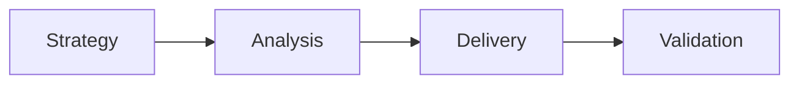

# VitePress

VitePress is a static site generator built on Vue and Vite, designed for fast, content-focused documentation sites. It uses Markdown files as the source, compiles them at build time and ships a fully static output ready to deploy on any CDN or hosting platform.

## Quick Start

Install VitePress as a development dependency in a new or existing project:

```bash
npm add -D vitepress
```

Initialize a new site:

```bash
npx vitepress init
```

The wizard creates the minimal directory layout and a starter `config.ts`. Default answers are fine for most documentation projects.

### Basic Commands

| Command | Purpose |
| --- | --- |
| `npx vitepress dev` | Start the local dev server with hot reload |
| `npx vitepress build` | Build the static site to `.vitepress/dist/` |
| `npx vitepress preview` | Preview the production build locally |

Add these to `package.json` scripts for convenience:

```json
{
  "scripts": {
    "docs:dev": "vitepress dev",
    "docs:build": "vitepress build",
    "docs:preview": "vitepress preview"
  }
}
```

## Base Configuration

All site configuration lives in `.vitepress/config.ts`. A minimal but production-ready setup covers the site title, description, navigation and sidebar.

```ts
import { defineConfig } from 'vitepress'

export default defineConfig({
  title: "My Project Docs",
  description: "Documentation for My Project",
  themeConfig: {
    nav: [
      { text: 'Home', link: '/' },
      { text: 'Layers', link: '/layers/' },
    ],
    sidebar: {
      '/layers/': [
        {
          text: 'Analysis',
          link: '/layers/analysis/',
          collapsed: true,
          items: [
            { text: 'Requirements', link: '/layers/analysis/requirements/' },
          ]
        },
      ]
    },
    socialLinks: [
      { icon: 'github', link: 'https://github.com/your-org/your-repo' }
    ]
  }
})
```

### Key Options

| Option | Purpose |
| --- | --- |
| `title` | Site name shown in the browser tab and nav bar |
| `description` | Meta description used by search engines |
| `srcDir` | Source directory for Markdown files (default: repo root) |
| `srcExclude` | Glob patterns for files to exclude from the build |
| `themeConfig.nav` | Top navigation bar items |
| `themeConfig.sidebar` | Sidebar structure, keyed by path prefix |
| `themeConfig.logo` | Site logo shown in the nav bar |
| `ignoreDeadLinks` | Set to `true` to suppress dead link build errors |

## Disciplinary Structure

Project documentation sites organized by disciplinary layers benefit from a `layers/` directory that groups the layer folders. This approach keeps the root clean, makes navigation predictable and simplifies the `config.ts` sidebar structure.

Recommended folder layout:

```text
project-docs/
├── .vitepress/
│   └── config.ts
├── index.md
├── layers/
│   ├── index.md
│   ├── analysis/
│   │   ├── index.md
│   │   ├── requirements/
│   │   └── use-cases/
│   ├── architecture/
│   ├── delivery/
│   ├── strategy/
│   └── validation/
└── specs/
```

### Sidebar Auto-Collapse

When the sidebar has many nested sections, opening one section should ideally collapse the others. VitePress does not offer this natively, but the `useSidebar` composable from `vitepress/dist/client/theme-default/composables/sidebar.js` exposes the reactive sidebar state that a custom component can intercept to collapse inactive groups.

A minimal `SidebarAutoCollapse.vue` component inserted in the `layout-bottom` slot monitors route changes and calls the collapse API on inactive sidebar items:

```ts
// .vitepress/theme/index.ts
import { h } from 'vue'
import type { Theme } from 'vitepress'
import DefaultTheme from 'vitepress/theme'
import SidebarAutoCollapse from './SidebarAutoCollapse.vue'

export default {
  extends: DefaultTheme,
  Layout: () => {
    return h(DefaultTheme.Layout, null, {
      'layout-bottom': () => h(SidebarAutoCollapse)
    })
  }
} satisfies Theme
```

## Layouts and Components

VitePress ships with three built-in layouts: `home`, `doc` (default) and `page`. A custom layout can be registered as a Vue component and activated via the `layout` frontmatter key.

### Available Layouts

| Layout | Behavior |
| --- | --- |
| `doc` | Standard documentation page with sidebar, aside and prev/next navigation. Default when no `layout` key is specified. |
| `home` | Full-width landing page with hero and features sections. Hides sidebar and aside. |
| `page` | Full-width page with no sidebar, aside or prev/next navigation. Useful for custom standalone pages. |

### `section-home` Custom Layout

Projects with multiple sections benefit from a `section-home` layout: a page that looks like a `doc` page (with sidebar and aside), but includes a hero and features block above the Markdown content. This lets each section have a discoverable entry point while remaining part of the normal navigation flow.

Register the component in the theme entry and use `layout: section-home` in frontmatter:

```ts
// .vitepress/theme/index.ts
import SectionHomeLayout from './SectionHomeLayout.vue'

export default {
  extends: DefaultTheme,
  enhanceApp({ app }) {
    app.component('section-home', SectionHomeLayout)
  }
} satisfies Theme
```

```md
---
layout: section-home

hero:
  name: "Analysis"
  text: "Needs, Requirements and Use Cases"
  tagline: Artifacts for understanding and formalizing business needs.
  actions:
    - theme: brand
      text: Requirements
      link: /layers/analysis/requirements/

features:
  - icon: 🔎
    title: Requirements
    details: Formalized needs and expected behaviors derived from stakeholder input.
    link: /layers/analysis/requirements/
---

# Analysis Layer

Body content appears below the hero and features.
```

## Recommended Plugins

### vitepress-plugin-mermaid

[Mermaid](https://mermaid.js.org) diagrams can be embedded in Markdown using fenced code blocks with the `mermaid` language tag. The `vitepress-plugin-mermaid` package integrates Mermaid into the VitePress build pipeline.

Install:

```bash
npm add -D vitepress-plugin-mermaid mermaid
```

Activate by wrapping the default export in `config.ts` with `withMermaid`:

```ts
import { withMermaid } from 'vitepress-plugin-mermaid'

export default withMermaid({
  title: "My Project Docs",
  // ...rest of config
})
```

Use in Markdown:

````md

````

Mermaid supports flowcharts, sequence diagrams, entity-relationship diagrams, Gantt charts and more. No additional configuration is needed beyond wrapping the config with `withMermaid`.

## Deployment

VitePress produces a fully static output in `.vitepress/dist/`. Any static hosting platform can serve it without a server runtime.

Run the build before deploying:

```bash
npm run docs:build
```

### Common Hosting Options

| Platform | Deployment Method |
| --- | --- |
| GitHub Pages | Push `dist/` to a `gh-pages` branch via a GitHub Actions workflow |
| Netlify | Connect the repo, set build command to `npm run docs:build` and publish directory to `.vitepress/dist` |
| Vercel | Same as Netlify; Vercel auto-detects VitePress projects |
| Cloudflare Pages | Connect the repo, same build settings as Netlify |
| Any CDN | Upload the contents of `.vitepress/dist/` to the CDN origin |

A minimal GitHub Actions workflow for GitHub Pages:

```yaml
name: Deploy Docs

on:
  push:
    branches: [main]

jobs:
  deploy:
    runs-on: ubuntu-latest
    steps:
      - uses: actions/checkout@v4
      - uses: actions/setup-node@v4
        with:
          node-version: 20
      - run: npm ci
      - run: npm run docs:build
      - uses: peaceiris/actions-gh-pages@v4
        with:
          github_token: ${{ secrets.GITHUB_TOKEN }}
          publish_dir: .vitepress/dist
```

## References

- [VitePress — Official Docs](https://vitepress.dev) — Full reference for configuration, theming, frontmatter and deployment.
- [VitePress — Sidebar Config](https://vitepress.dev/reference/default-theme-sidebar) — All sidebar options including `collapsed`, `items` nesting and multiple sidebar roots.
- [VitePress — Custom Theme](https://vitepress.dev/guide/custom-theme) — How to extend the default theme with custom layouts and components.
- [Mermaid — Official Docs](https://mermaid.js.org) — Diagram types, syntax reference and live editor.
- [vitepress-plugin-mermaid on npm](https://www.npmjs.com/package/vitepress-plugin-mermaid) — Plugin installation and configuration options.

[← Static Site Generators](/discovery/documentation/static-site-generators/)
