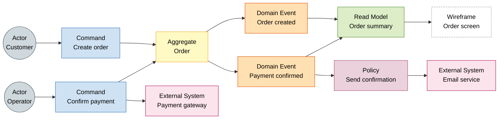

# Event Storming

Collaborative workshop to discover domain events, commands, aggregates and business policies visually and participatively.

## What Is Event Storming?

Event Storming is a collaborative modeling technique that brings together business and technology people around a shared board to explore a domain quickly and effectively. The result is a visual map of the key business processes expressed in domain language.

## When to Use It

- Project or new initiative kickoff.
- Discovery and delimitation of Bounded Contexts.
- Alignment between business and technology before designing the solution.
- Identification of areas of high complexity or risk.
- Requirements refinement with non-technical stakeholders.

## Artifacts (Post-it Notation)

Use business terms in the ubiquitous language selected for the Bounded Context. The notation labels, such as `Command`, `Aggregate`, `Domain Event`, `Policy`, `Read Model`, `External System` and `Wireframe`, can remain in English as technical Event Storming vocabulary.

| Color | Artifact | Description |
| --- | --- | --- |
| 🟠 Orange | **Domain Event** | Relevant fact that occurred in the past. Past tense verb: `OrderPlaced`, `PaymentApproved` or `PedidoCapturado`, `PagoAprobado`. |
| 🔵 Blue | **Command** | Intention or action that triggers an event. Imperative: `PlaceOrder`, `ApprovePayment` or `CapturarPedido`, `AprobarPago`. |
| 🟡 Yellow | **Aggregate** | Entity or cluster of entities that processes the command and produces the event. |
| 🟣 Lilac | **Policy** | Business rule or reaction: "When X occurs, then Y". |
| 🟢 Green | **Read Model** | Information that an actor needs to make a decision (screen, report). |
| 🩷 Pink | **External System** | System or external service that emits or receives events. |
| ⬜ White | **Wireframe** | Screen or UI sketch that an actor needs to execute a command or query a view. Dashed border in digital diagrams; on physical boards it is a white post-it. |
| 🩶 Bluish Gray | **Actor / User** | Person or role that issues a command. Represented as a circle `(( ))` in digital diagrams; on physical boards it is a sticky person (stylized human figure). |

## Session Roles

| Role | Responsibility |
| --- | --- |
| **Facilitator** | Guides the process, explains the notation, manages time and dynamics. |
| **Business Expert** | Contributes domain knowledge and validates events and rules. |
| **Technical** | Proposes implementation, identifies technical constraints, models aggregates. |

## Recommended Process

1. **Preparation**: large space (wall or digital whiteboard), post-its in the defined colors, markers.
2. **Creative chaos**: each participant writes domain events (orange) freely and sticks them on the board. No order, no debate.
3. **Chronological order**: organize events from left to right in a timeline.
4. **Identify commands**: what action caused each event? Add commands (blue).
5. **Identify actors and views**: who issues the command and what information do they need? Add actors and views (green).
6. **Identify aggregates**: what entity processes the command? Add aggregates (yellow).
7. **Identify policies**: what automatic reactions exist? Add policies (lilac).
8. **Identify external systems**: what external systems participate? Add in pink.
9. **Delimit Bounded Contexts**: group related events and draw context boundaries.
10. **Generate ubiquitous language**: document agreed terms for each context.

## Suggested Tools

- **In-person**: kraft paper, adhesive post-its, colored markers.
- **Remote/Hybrid**: [Miro](https://miro.com), [Excalidraw](https://excalidraw.com), [Notion](https://notion.so).

## Connection with VSA

Event Storming results map directly to Vertical Slice Architecture artifacts:

| Event Storming Artifact | VSA / Code Artifact |
| --- | --- |
| Command (blue) | `[ActionName]Command.cs` in `Features/.../Commands/` |
| Domain Event (orange) | Event published from the `CommandHandler` |
| Aggregate (yellow) | `[ActionName]State.cs` — entity managed by the slice |
| Read Model (green) | `[ActionName]Query.cs` in `Features/.../Queries/` |
| Policy (lilac) | Worker or Background Service that reacts to the event |
| Bounded Context | Module in `Features/` (e.g. `Inventory`, `Sales`, `Security`) |

## Cross Reference

- [Domain Modeling](/foundations/domain-modeling/) — DDD concepts that complement Event Storming.
- [Vertical Slice Architecture](/engineering/backend/architecture/vertical-slice-architecture) — how to implement the identified slices.
