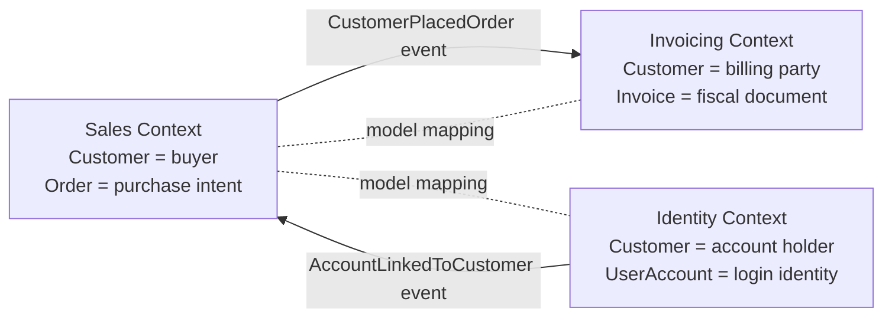
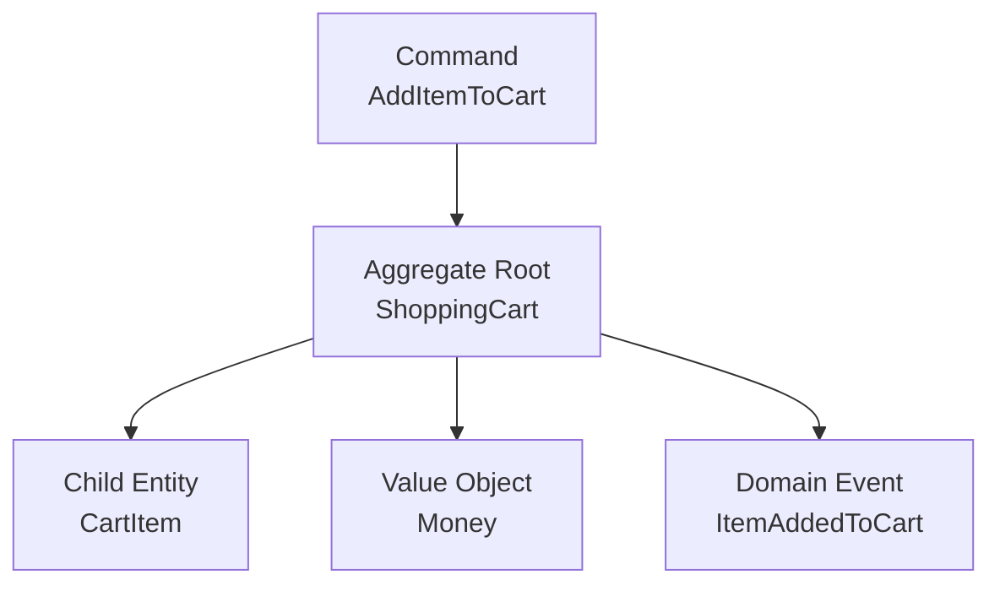
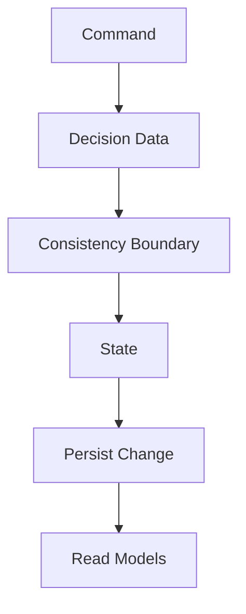

# Domain-Driven Design

> [!IMPORTANT]
> This page is a broad non-normative reference. Follow the [canonical Domain Modeling path](/foundations/domain-modeling/) for concepts; mentions of VSA, persistence, auditing and identifiers are profiles or examples.

Principles and patterns of DDD applied pragmatically in the Flowsy ecosystem, complementing Vertical Slice Architecture.

## What is DDD?

Domain-Driven Design (DDD) is a software design approach that places the business domain at the center of technical decisions. The code should reflect the language and concepts of the business, not the other way around.

In Flowsy, DDD is applied pragmatically: not all its patterns need to be adopted from the start. It is applied where it adds real value, especially in modeling complex behaviors.

Concepts such as Bounded Context and Aggregate are often discussed in Event Sourcing, CQRS and microservice literature because those styles make consistency and ownership boundaries very visible. They are not exclusive to those paradigms. A modular monolith, a transactional relational application, a CRUD system with meaningful rules or a traditional layered architecture can still benefit from explicit domain language, Bounded Contexts and well-designed Aggregates.

## Key Principles

- **Ubiquitous Language**: a shared and agreed vocabulary with the business, used in conversations, code, documentation and tests.
- **Bounded Contexts**: explicit boundaries where a specific domain language, model and set of rules are consistent.
- **Model-Driven Design**: the code directly expresses domain concepts.
- **Iteration with the Business**: the model evolves with domain knowledge, it is not designed all at once.

## Model Language Strategy

Choose the language of the domain model with domain experts and the delivery team. Flowsy documentation is written in English by default, but a project may deliberately model aggregates, entities, value objects, commands, events and data objects in another language when that better reflects the business language.

| Strategy | When It Fits | Examples |
| --- | --- | --- |
| English domain model | The product, team, documentation and integrations use English consistently. | `ShoppingCart`, `AddItem`, `CartCheckedOut` |
| Business-language domain model | Domain experts and operational processes use another language as the main business language. | `CarritoCompra`, `AgregarArticulo`, `CarritoCompraConfirmado` |
| Mixed strategy with boundaries | The team works within an English-language platform ecosystem but models the domain using another language agreed with domain experts. Infrastructure code — adapters, API clients, integration services — stays in English because it maps to platform concepts and third-party contracts. Domain aggregates, commands, events and queries use the business language because they reflect the terms used in conversations with the business. This boundary must be documented and enforced by each Bounded Context. | Infrastructure: `ShoppingCartIntegrationClient`. Domain: `CarritoCompra`, `ConfirmarCarritoCompra`, `CarritoCompraConfirmado`. |

Keep the decision consistent inside each Bounded Context and document exceptions. The data model should follow the same language strategy unless integration, reporting or platform constraints justify a different one.

For Spanish identifiers in code and data models, prefer compact business names without articles or prepositions when meaning is preserved: `PedidoCliente`, `AsignacionDireccionEnvio`, `id_pedido_cliente`. Keep the natural phrase in user-facing text: "Pedido de cliente", "Asignación de dirección de envío". Preserve articles and prepositions in identifiers only when they are official, necessary to avoid ambiguity or improve clarity.

Technical pattern names remain in English when they are part of the software design vocabulary. For example, keep `Domain-Driven Design`, `Bounded Context`, `Value Object`, `Aggregate`, `Repository`, `Factory`, `Adapter`, `Outbox`, `Saga`, `Vertical Slice Architecture`, `Clean Architecture`, `Minimal API` and framework names in English, while translating the business concepts that belong to the model.

## Fundamental Concepts

DDD concepts operate at different levels. Strategic concepts define language, ownership and model boundaries. Tactical concepts describe the building blocks used to model behavior and consistency. Implementation concepts explain how those ideas are commonly organized in code, especially when applying Vertical Slice Architecture.

### Strategic Concepts

#### Bounded Contexts

A Bounded Context is a conceptual boundary inside the domain. Within that boundary, terms have precise meaning and the model can evolve without being forced to match every other part of the system.

For example, `Customer` may mean a buyer in a `Sales` context, an account holder in an `Identity` context and a billing party in an `Invoicing` context. DDD does not require those meanings to collapse into one global class. Instead, each context owns its language, rules, entities, value objects, events and persistence decisions.

Bounded Contexts are not a folder convention or a specific architecture. A project may implement them using modules, packages, projects, namespaces, services, schemas, feature sets or another structure that fits its language, framework and architecture. When a project uses Vertical Slice Architecture, a folder such as `Features/` can be a practical way to organize features by module or context, but it is not required by DDD.

A Bounded Context can exist without Event Sourcing, CQRS or microservices. The essential idea is semantic ownership: one model, one language and one set of rules are valid inside a defined boundary, regardless of whether the implementation uses relational tables, ORM entities, stored procedures, document storage or event streams.

Think of a Bounded Context as the place where a model is allowed to be internally precise. Outside the boundary, similar words may exist, but they are not automatically the same concept. This protects teams from forcing one global model to satisfy different operational realities.



Solid arrows represent domain events flowing from one context to another. Dashed lines indicate that the two contexts must explicitly agree on how to translate their models when exchanging data. The word `Customer` means something different in each context; neither can assume the other uses the same definition. The consuming context must translate or adapt the data it receives into its own model before using it. This translation is commonly implemented as an **Anti-Corruption Layer (ACL)** — an adapter that converts incoming concepts into the internal language of the consuming context, protecting its model from being contaminated by another context's terminology.

| Aspect | Inside One Bounded Context | Between Bounded Contexts |
| --- | --- | --- |
| Language | Terms have one precise meaning. | Terms may be translated or mapped. |
| Model | Entities, Value Objects, Aggregates and rules can be cohesive. | Models integrate through contracts, events, APIs or anti-corruption layers. |
| Ownership | One team or team group can evolve the model with clear accountability. | Collaboration happens through explicit agreements. |
| Persistence | The context can choose its own schema, storage and migration strategy. | Shared databases are treated carefully because they can blur ownership. |

Use Bounded Contexts when:

- the same term has different meanings in different areas of the business;
- teams need autonomy over different parts of the model;
- integrations require explicit contracts between domain areas;
- one shared model would create confusing names, excessive coupling or constant negotiation.

Document the chosen implementation mapping in the project architecture guide. For example, one project may map a Bounded Context to a service, another to a .NET project, another to a Java package and another to a VSA `Features/<Module>/` folder.

Common implementation mappings:

| Mapping | When It Fits | Main Risk |
| --- | --- | --- |
| Modular monolith module | One deployable system with clear internal ownership boundaries. | Boundaries can erode if modules access each other's internals. |
| Microservice | Context needs independent deployment, scaling or ownership. | Distributed workflows, observability and data consistency become harder. |
| Package / project / namespace | Team wants explicit code ownership without service distribution. | Too much shared infrastructure can hide coupling. |
| Database schema | Persistence ownership is important and the database engine supports schemas well. | Cross-schema joins can turn into implicit coupling. |
| VSA `Features/<Module>/` folder | The codebase is organized around vertical slices and modules. | A folder is only a boundary if dependencies are controlled. |

Before drawing a boundary, ask:

- What words change meaning across teams, policies or workflows?
- Which rules must evolve independently?
- Which data can be eventually consistent between areas?
- Which team owns the language and decisions inside the boundary?
- What integration contract will prevent leaking one model into another?

### Tactical Concepts

#### Entity

Representation of a domain concept with **unique and persistent identity**. Its identity does not change even if its attributes change.

- English examples: `Product`, `Order`, `ShoppingCart`, `UserAccount`, `Customer`.
- Spanish examples: `Producto`, `Pedido`, `CarritoCompra`, `CuentaUsuario`, `Cliente`.
- In C#: model with `class` or `record class` with explicit ID.

#### Value Object

Object that represents a domain concept **without its own identity**, defined solely by its properties.

- English examples: `PostalAddress`, `CartSummary`, `PhoneNumber`, `DateRange`.
- Spanish examples: `DireccionPostal`, `ResumenCarrito`, `NumeroTelefono`, `RangoFechas`.
- In C#: model with `record` (value comparison).
- Encapsulate validation, parsing and normalization in the object itself.

#### Domain Rule

Constraint or condition that must be satisfied within the domain.

- Examples:
  - "A cart cannot have more than 100 products."
  - "An order cannot be cancelled if it has already been shipped."
  - "Un carrito no puede tener más de 100 productos."
  - "Un pedido no puede cancelarse si ya fue enviado."
- Implement inside the `State` of the corresponding command, not in the handler.
- Express the rule in application/domain code before persistence; database constraints may reinforce integrity, but they should not be the only place where the business rule exists.

See [Error Handling](/engineering/backend/reliability/error-handling-reference) for validation order and infrastructure error boundaries.

#### Aggregates

An Aggregate is a consistency boundary inside a Bounded Context. It groups the state and behavior that must be modified and persisted as one atomic unit to protect business invariants. The Aggregate Root is the only object that external code should use to modify the Aggregate.

An Aggregate is not just a tree of related database rows. It is a decision-making unit: it receives an intention, checks the rules that must be true now and produces a state change or domain event.

Aggregates can be implemented with traditional transactional persistence, such as an ORM and relational database transaction, or with Event Sourcing and optimistic concurrency over event streams. The pattern is about enforcing invariants and controlling changes through the Aggregate Root; the persistence style is an implementation choice.



##### Classical Aggregate

A classical Aggregate is a static consistency boundary designed around a central domain concept. It often concentrates behavior, rules and child entities in one Aggregate Root. This is the traditional model many teams first learn in DDD: the Aggregate protects all invariants that belong to that concept and persists changes atomically.

Example:

```csharp
public class ShoppingCart
{
    private readonly List<CartItem> _items = [];

    public Guid ShoppingCartId { get; }
    public Guid UserAccountId { get; }
    public IReadOnlyCollection<CartItem> Items => _items.AsReadOnly();
    public int TotalItems => _items.Sum(item => item.Quantity);

    public void AddItem(Guid productId, int quantity)
    {
        if (quantity <= 0)
            throw new DomainRuleException("Quantity must be positive.");

        if (TotalItems + quantity > 100)
            throw new DomainRuleException("A cart cannot have more than 100 items.");

        _items.Add(new CartItem(productId, quantity));
    }
}
```

Equivalent Spanish business language:

```csharp
public class CarritoCompra
{
    private readonly List<ArticuloCarrito> _articulos = [];

    public Guid IdCarritoCompra { get; }
    public Guid IdCuentaUsuario { get; }
    public IReadOnlyCollection<ArticuloCarrito> Articulos => _articulos.AsReadOnly();
    public int TotalArticulos => _articulos.Sum(articulo => articulo.Cantidad);

    public void AgregarArticulo(Guid idProducto, int cantidad)
    {
        if (cantidad <= 0)
            throw new DomainRuleException("La cantidad debe ser positiva.");

        if (TotalArticulos + cantidad > 100)
            throw new DomainRuleException("Un carrito no puede tener más de 100 artículos.");

        _articulos.Add(new ArticuloCarrito(idProducto, cantidad));
    }
}
```

Advantages:

| Advantage | Why It Helps |
| --- | --- |
| Strong consistency | All rules inside the boundary are checked in one transaction or optimistic concurrency scope. |
| Clear encapsulation | External code cannot bypass the Aggregate Root. |
| Natural model for rich behavior | The domain object expresses business language directly. |
| Simple mental model for small teams | One central object owns the rules for one concept. |

Disadvantages:

| Disadvantage | Consequence |
| --- | --- |
| Can grow too large | Many commands and rules accumulate in one class or event stream. |
| Higher contention | Unrelated operations may conflict because they share one static boundary. |
| Harder evolution | Splitting the Aggregate later can require persistence, event and API changes. |
| Risk of noun-driven modeling | Teams may group data because it belongs to the same noun, not because it must be consistent together. |

Use a classical Aggregate when:

- the invariant truly belongs to one concept and must be immediately consistent;
- the Aggregate is small enough to understand, load and test easily;
- the system is CRUD-plus-rules, a modular monolith or a transactional application with moderate concurrency;
- the team benefits from a simple and explicit object model;
- the domain behavior is rich but the consistency boundary is stable.

##### Dynamic Consistency Boundary

Dynamic Consistency Boundary (DCB) keeps the original goal of Aggregates, protecting consistency, but avoids hardwiring every decision into one static Aggregate boundary. It fits naturally with Event Sourcing because events make decision history explicit, but the underlying idea is broader: for each command, load only the information required for that specific decision, validate the rules, and persist the change with a concurrency mechanism that protects exactly that decision boundary.

That decision information may come from previously recorded domain events, current projections, relational tables, counters, statuses or read models. The consistency check may be an event append condition, an optimistic concurrency version, a database transaction with appropriate locks, a unique constraint, a check constraint or a combination of those mechanisms.

For example, when deciding whether a customer can add an item to a shopping cart, the approach is behavior-oriented and contextual: the boundary is not "everything related to `ShoppingCart`" or "everything related to `Product`"; it is "the minimal set of data and domain history this command needs to decide correctly."



In this example, `Decision Data` represents the student's active courses and the course enrollment. `Consistency Boundary` represents the selected student, course and data that must not change unnoticed while the command is being processed. `State` represents the slice decision model used by the command. `Persist Change` can mean appending events or updating relational tables inside a transaction.

In a VSA implementation, this temporary decision model is usually represented by the slice `State`, and the `StateHandler` is the component that loads the required decision information and enforces the persistence or append condition. The important distinction is that, in DCB, the `State` does not have to mirror one static Aggregate. It can be shaped by the behavior being executed.

English business example:

```csharp
public sealed class StudentJoinsCourseState
{
    public StudentJoinsCourseState(
        IReadOnlyCollection<CourseEnrollment> studentEnrollments,
        IReadOnlyCollection<CourseEnrollment> courseEnrollments)
    {
        StudentEnrollments = studentEnrollments;
        CourseEnrollments = courseEnrollments;
    }

    public IReadOnlyCollection<CourseEnrollment> StudentEnrollments { get; }
    public IReadOnlyCollection<CourseEnrollment> CourseEnrollments { get; }

    public void EnsureStudentCanJoin(Guid studentId, Guid courseId)
    {
        if (StudentEnrollments.Count(enrollment => enrollment.IsActive) >= 5)
            throw new DomainStateValidationException("The student cannot exceed 5 active courses.");

        if (CourseEnrollments.Count(enrollment => enrollment.IsActive) >= 30)
            throw new DomainStateValidationException("The course is already full.");

        if (CourseEnrollments.Any(enrollment => enrollment.StudentId == studentId && enrollment.CourseId == courseId))
            throw new DomainStateValidationException("The student is already enrolled in this course.");
    }
}
```

Equivalent Spanish business language:

```csharp
public sealed class AlumnoSeInscribeCursoState
{
    public AlumnoSeInscribeCursoState(
        IReadOnlyCollection<InscripcionCurso> inscripcionesAlumno,
        IReadOnlyCollection<InscripcionCurso> inscripcionesCurso)
    {
        InscripcionesAlumno = inscripcionesAlumno;
        InscripcionesCurso = inscripcionesCurso;
    }

    public IReadOnlyCollection<InscripcionCurso> InscripcionesAlumno { get; }
    public IReadOnlyCollection<InscripcionCurso> InscripcionesCurso { get; }

    public void AsegurarInscripcionPermitida(Guid idAlumno, Guid idCurso)
    {
        if (InscripcionesAlumno.Count(inscripcion => inscripcion.EstaActiva) >= 5)
            throw new DomainStateValidationException("El alumno no puede exceder 5 cursos activos.");

        if (InscripcionesCurso.Count(inscripcion => inscripcion.EstaActiva) >= 30)
            throw new DomainStateValidationException("El curso ya está lleno.");

        if (InscripcionesCurso.Any(inscripcion => inscripcion.IdAlumno == idAlumno && inscripcion.IdCurso == idCurso))
            throw new DomainStateValidationException("El alumno ya está inscrito en este curso.");
    }
}
```

Example decision:

| Rule | Information Needed | Boundary |
| --- | --- | --- |
| A student cannot exceed 5 active courses. | Active enrollments for that student. | `StudentId` + active enrollment rows or enrollment events. |
| A course cannot exceed 30 students. | Active enrollments for that course. | `CourseId` + active enrollment rows or enrollment events. |
| A student cannot join the same course twice. | Enrollment for the student-course pair. | `StudentId` + `CourseId` + unique row, lock or enrollment events. |

In a classical model, the team may try to put the rule in either `Student` or `Course`, or create a large `StudentCourseEnrollment` Aggregate. With DCB, the `StudentJoinsCourse` behavior builds a temporary `State` from the exact information it needs, regardless of whether that information comes from an event store or relational tables.

Conceptual event-sourced pseudocode:

```csharp
public async Task Handle(StudentJoinsCourse command)
{
    var boundary = ConsistencyBoundary.For(
        Tag.Student(command.StudentId),
        Tag.Course(command.CourseId),
        EventTypes.StudentEnrolled,
        EventTypes.StudentLeftCourse);

    var decisionInformation = await eventStore.Read(boundary);
    var state = StudentJoinsCourseState.From(decisionInformation);

    state.EnsureStudentHasCapacity();
    state.EnsureCourseHasCapacity();
    state.EnsureStudentIsNotAlreadyEnrolled();

    await eventStore.Append(
        new StudentEnrolled(command.StudentId, command.CourseId),
        expectedBoundary: boundary);
}
```

Conceptual relational pseudocode:

```csharp
public async Task Handle(StudentJoinsCourse command)
{
    await using var transaction = await db.BeginTransactionAsync();
    var stateHandler = new StudentJoinsCourseStateHandler(db, transaction);

    var state = await stateHandler.LoadStateForUpdateAsync(
        new StudentCourseKey(command.StudentId, command.CourseId));

    state.EnsureStudentHasCapacity();
    state.EnsureCourseHasCapacity();
    state.EnsureStudentIsNotAlreadyEnrolled();

    await stateHandler.SaveEnrollmentAsync(
        new CourseEnrollment(command.StudentId, command.CourseId));

    await transaction.CommitAsync();
}
```

In a relational implementation, the `StateHandler` may use `SELECT ... FOR UPDATE`, serializable isolation, row versions, filtered unique indexes, check constraints or explicit application-level concurrency tokens. The point is not to imitate Event Sourcing, but to make the behavior's consistency boundary explicit and protected by the database and application together.

###### DCB as Design Approach: Implementation Paths

The strong recommendation is to approach every command with the DCB mental model: think about the minimum information required to make domain-rule-based decisions and apply the corresponding mutations, rather than loading large aggregates. This principle applies regardless of the implementation path chosen.

The implementation can take two valid paths depending on the complexity of the mutation.

###### Path 1 — Direct mutation in the command handler (simple mutations)

The command handler loads the required data and applies the domain mutation directly, without a dedicated `State` class or `StateHandler`. Use this path when:

- The mutation targets a single entity or a tightly coupled set.
- Business rules can be verified with a focused, minimal data load.
- Concurrency can be delegated to the database (row version, optimistic lock, unique constraint, check constraint).
- There is no need for an independently testable or reusable decision model.

```csharp
// DCB thinking: I only need the course status to decide whether
// deactivation is valid. No State or StateHandler needed.
public async Task Handle(DeactivateCourse command)
{
    var course = await db.Courses
        .Where(c => c.Id == command.CourseId)
        .FirstOrDefaultAsync()
        ?? throw new NotFoundException("Course not found.");

    if (!course.IsActive)
        throw new DomainStateValidationException("The course is already inactive.");

    course.Deactivate();
    await db.SaveChangesAsync();
}
```

###### Path 2 — State and StateHandler (complex mutations)

The command handler acts as an orchestrator: it opens the source-of-truth session or transaction, creates the concrete `StateHandler`, and uses it to load and persist `State`. The `State` encapsulates the domain decision logic. The `StudentJoinsCourse` examples above illustrate this path. Use it when:

- The mutation involves multiple entities or decision data from different sources.
- Business rules require combining information from more than one subject.
- Concurrency must be explicitly managed (`SELECT FOR UPDATE`, append conditions, row versions with locks).
- The decision model benefits from being tested in isolation.
- The behavior or decision logic may be reused across handlers.

Choosing between paths:

| Scenario | Recommended Path |
| --- | --- |
| Single entity, simple invariants | Direct mutation in handler |
| Single entity, concurrency-sensitive | Direct mutation + DB constraint or row version |
| Multiple entities or cross-cutting rules | State + StateHandler |
| Explicit concurrency boundary required | State + StateHandler |
| Decision model reused across handlers | State + StateHandler |

Advantages:

| Advantage | Why It Helps |
| --- | --- |
| Behavior-focused consistency | Each command protects exactly the decision information needed for its rule. |
| Less unnecessary contention | Unrelated operations do not collide just because they share a large Aggregate. |
| Better fit for cross-cutting decisions | Rules that involve several subjects can be modeled without forcing one owner. |
| Architectural agility | New behaviors can define new decision models without reshaping one central Aggregate. |

Disadvantages:

| Disadvantage | Consequence |
| --- | --- |
| Higher conceptual load | Teams must understand how each command chooses its decision data and consistency boundary. |
| Infrastructure dependency | The persistence mechanism must support reliable concurrency checks over the selected boundary. |
| More explicit modeling discipline | Business rules can scatter if commands do not name and document their decision model. |
| Younger ecosystem | Tooling, examples and team familiarity are less mature than classical Aggregates. |

Use DCB when:

- rules span multiple natural Aggregates and forcing one Aggregate Root creates artificial ownership;
- high concurrency makes large Aggregate streams, large transactional rows or static boundaries a bottleneck;
- workflows are behavior-centric and evolve frequently;
- the team can invest in explicit state modeling, concurrency checks and operational observability;
- the project uses Event Sourcing or a relational model with clear transactional and constraint discipline.

Avoid DCB when:

- the application is simple CRUD with a few local rules;
- the team is still learning basic DDD and does not yet have enough modeling discipline for behavior-specific boundaries;
- the persistence technology cannot enforce the required concurrency or integrity conditions reliably;
- the project does not need the additional flexibility enough to justify the complexity.

##### Choosing an Aggregate Approach

| Project Situation | Prefer Classical Aggregate | Prefer Dynamic Consistency Boundary |
| --- | --- | --- |
| Small or medium transactional system | Yes, especially when invariants are local. | Usually unnecessary. |
| Modular monolith with rich domain rules | Good default. Keep Aggregates small and cohesive. | Consider only for hot spots or cross-cutting rules. |
| High-throughput event-sourced system | Works when streams are small and command boundaries are stable. | Strong candidate when static streams cause contention. |
| Relational system with cross-row invariants | Works when one Aggregate row or transaction naturally owns the rule. | Consider when the rule spans selected rows and can be protected with transactions, locks, versions or constraints. |
| Rule spans several subjects | May require domain service, process manager or eventual consistency. | Good fit when the decision needs strong consistency across selected domain events, statuses or counters. |
| Team is new to DDD | Easier to teach and review. | Introduce later, after the team understands Aggregates and events. |
| Domain behavior changes frequently | Can become hard to reshape if boundaries were chosen too early. | Useful when decision boundaries vary by behavior. |

Practical recommendation:

1. Start by discovering Bounded Contexts and language with domain experts.
2. Model the behavior first: commands, decisions, invariants and events.
3. Use classical Aggregates for rules that are naturally local and stable.
4. Keep Aggregates small; reference other Aggregates by identity, not by object graph.
5. Use domain events and eventual consistency between Aggregate boundaries unless the business rule requires immediate consistency.
6. Consider DCB for event-sourced, relational, high-concurrency or cross-cutting decisions where a static Aggregate would be artificial or too large.

### Implementation Concepts

#### Domain State

Representation of the domain at a given moment, built from databases, files or external services; modeled with entities and value objects.

- In VSA, the `State` encapsulates the entities needed to execute a command and validate domain rules.

#### Feature

Specific functionality that adds value to the end user and is related to the domain.

- English examples: `AddItemToCart`, `CheckOrderStatus`, `SuspendUserAccount`.
- Spanish examples: `AgregarArticuloCarrito`, `ConsultarEstadoPedido`, `SuspenderCuentaUsuario`.
- In Vertical Slice Architecture, a feature can be implemented as an independent slice under a convention such as `Features/`. Other architectures may place the same behavior in use-case classes, application services, handlers, modules or packages.

#### Module

Set of related features, optionally subdivided into submodules.

- English examples: `Inventory`, `Sales`, `Security`.
- Spanish examples: `Inventario`, `Ventas`, `Seguridad`.
- May represent a Bounded Context, part of a Bounded Context or an implementation grouping, depending on the project's architecture and domain boundaries.

#### Submodule

Smaller grouping of features within a module.

- English examples: `Sales/OrderPlacement`, `Sales/OrderBilling`.
- Spanish examples: `Ventas/CapturaPedidos`, `Ventas/FacturacionPedidos`.

#### Vertical Slice

Pattern that organizes code by specific feature. Each slice contains everything needed: models, logic, validations, endpoints and its own infrastructure.

## Entity Record Status

For normative guidance on record existence, audit attributes and business validity, prefer [Auditing and Validity](/engineering/cross-cutting/auditing-and-validity). The sections below keep complementary detail and bilingual examples.

For auditable entities, define an explicit existence state. Choose the smallest representation that still expresses the domain, compliance and operational requirements.

| English State | Spanish State | English Description | Spanish Description |
| --- | --- | --- | --- |
| `Active` | `Activo` | Normal operational state. | Estado operativo normal. |
| `SoftDeleted` | `EliminadoLogico` | Recoverable deletion that preserves historical traceability. | Eliminación lógica recuperable que conserva la trazabilidad histórica. |
| `HardDeleted` | `EliminadoFisico` | Permanent deletion without breaking historical traceability. | Eliminación física sin romper la trazabilidad histórica. |

If the business requires functional names, document the functional→technical mapping in the specification.

### Representation Alternatives

Use one of these alternatives when the entity must expose its record existence state:

| Alternative | English Attribute | Spanish Attribute | Type | Use When |
| --- | --- | --- | --- | --- |
| Boolean flag | `Active` | `Activo` | `boolean` / `bool` | The entity only needs to distinguish active records from records that should not participate in normal operations. In many cases this value can be calculated from `ActiveFrom` and `ActiveUntil`. |
| Explicit status | `RecordStatus` | `EstadoRegistro` | `enum` | The entity needs more than two states, such as `Active`, `SoftDeleted` and `HardDeleted`, or their Spanish equivalents `Activo`, `EliminadoLogico` and `EliminadoFisico`. |

Use active-state fields only when the entity needs to record the period in which the record itself was active:

| Purpose | English Attribute | Spanish Attribute | Type Guidance | Description |
| --- | --- | --- | --- | --- |
| Active-state start | `ActiveFrom` | `ActivoDesde` | Instant or canonical system-time value according to the project's date/time strategy. | Date and time when the record starts being `Active`. |
| Active-state end | `ActiveUntil` | `ActivoHasta` | Nullable instant. | Date and time when the record stops being `Active`. |

Active-state fields such as `ActiveFrom`, `ActiveUntil`, `ActivoDesde` and `ActivoHasta` do not apply to every entity. Determine during analysis and design which aggregates need to record the period in which the record itself was active, such as catalog records, configuration records, reference data, published policies or rows that use soft deletion with historical traceability.

## Audit Attributes

For normative audit and validity policy, prefer [Auditing and Validity](/engineering/cross-cutting/auditing-and-validity). The tables below keep complementary bilingual examples.

Design audit attributes according to the requirements of each project, domain and actor model. The guide proposes common attributes, but each team must validate them through requirements analysis instead of treating one fixed list as universal: some domains need to know the user that performed an action, while others need to record the application, service account, integration, device, tenant or process that caused the change.

For record existence state, use the strategy defined in [Entity Record Status](#entity-record-status). Audit attributes below complement that lifecycle decision; they should not redefine it.

| Purpose | English Attribute | Spanish Attribute | Type Guidance | Description |
| --- | --- | --- | --- | --- |
| Creation instant | `CreatedAt` | `Creado` | Instant. | Date and time when the entity was created. |
| Creation actor | `CreatedBy`, `CreatedBy*Id` | `CreadoPor`, `Id*Creacion` | Depends on the actor model. | Identifier of the user, application, service, process or other actor that created the entity. |
| Last modification instant | `UpdatedAt` | `Modificado` | Instant. | Date and time when the entity was last modified. |
| Last modification actor | `UpdatedBy`, `UpdatedBy*Id` | `ModificadoPor`, `Id*Modificacion` | Depends on the actor model. | Identifier of the user, application, service, process or other actor that last modified the entity. |

Choose names in the language and naming style of the project. The data type for actor fields such as `CreatedBy`, `UpdatedBy`, `CreadoPor` and `ModificadoPor` depends on each project's requirements and identity model: a user ID, application ID, service account, external subject or another actor representation may be appropriate.

| Language Strategy | Example Entity | Example Attributes |
| --- | --- | --- |
| English domain and code | `UserAccount` | `CreatedAt`, `CreatedByUserId`, `UpdatedAt`, `UpdatedByApplicationId` |
| Spanish domain and code | `CuentaUsuario` | `Creado`, `IdUsuarioCreacion`, `Modificado`, `IdAplicacionModificacion` |

## Business Validity

Do not use `ActiveFrom` / `ActiveUntil` for business validity periods such as a contract administrator appointment, a supervisor assignment, a user role grant, a price validity period or a contract term. Existence state answers whether the record participates in the system. Business validity answers whether a business right, assignment, policy, price or term is currently effective.

Use one of these alternatives when the domain needs an explicit validity state:

| Alternative | English Attribute | Spanish Attribute | Type | Use When |
| --- | --- | --- | --- | --- |
| Boolean flag | `Valid` | `Vigente` | `boolean` / `bool` | The domain only needs to distinguish currently valid items from non-valid items. In many cases this value can be calculated from `ValidFrom` and `ValidUntil`. |
| Explicit status | `ValidityStatus` | `EstadoVigencia` | `enum` | The domain needs states such as `Valid`, `Revoked`, `Expired`, `Suspended` or `PendingReview`. |

| Purpose | English Attribute | Spanish Attribute | Type Guidance | Description |
| --- | --- | --- | --- | --- |
| Validity start | `ValidFrom` | `VigenteDesde` | Instant or business local date/time, depending on the domain. | Date and time when the business validity starts. |
| Validity end | `ValidUntil` | `VigenteHasta` | Nullable instant or business local date/time. | Date and time when the business validity ends. |

Name validity fields with the domain concept when a generic name would be ambiguous:

| Context | English Example | Spanish Example |
| --- | --- | --- |
| Appointment | `AppointmentValidFrom`, `AppointmentValidUntil` | `NombramientoVigenteDesde`, `NombramientoVigenteHasta` |
| Assignment | `AssignmentValidFrom`, `AssignmentValidUntil` | `AsignacionVigenteDesde`, `AsignacionVigenteHasta` |
| Role grant | `RoleGrantValidFrom`, `RoleGrantValidUntil` | `RolVigenteDesde`, `RolVigenteHasta` |

The guide shows common audit and validity attributes, but it does not recommend adding all of them to every entity. Apply only the fields that are useful for each entity, and add other project-specific attributes when the domain, compliance or operational design requires them.

## Public Identifiers

For normative public-identifier policy, prefer [Public Identifiers](/engineering/cross-cutting/identifiers). The section below keeps complementary detail and bilingual examples.

Do not expose numeric auto-increment primary keys outside backend applications, trusted internal jobs or controlled operational tooling. Sequential numeric IDs can reveal record volume, make enumeration easier and couple external contracts to persistence details.

For externally visible contracts, include a public identifier in the domain and persistence model:

| Purpose | English Attribute | Spanish Attribute | Recommended Type | Notes |
| --- | --- | --- | --- | --- |
| Public identifier | `PublicId` | `IdPublico` | UUID v4 or UUID v7 | Use v4 for random identifiers and v7 when ordered UUIDs help storage locality or event ordering. Choose according to project design and database support. |

Model public and internal variants explicitly instead of reusing one shape everywhere:

| Variant | English Example | Spanish Example | Includes |
| --- | --- | --- | --- |
| Public model | `UserAccountOverview` | `CuentaUsuarioResumen` | `PublicId` / `IdPublico` and attributes safe for external consumers. |
| Recommended internal model | `UserAccountOverviewInternal` | `CuentaUsuarioResumenInterno` | Same public attributes plus backend-only identifiers or operational fields. |
| Alternative private model | `UserAccountOverviewPrivate` | `CuentaUsuarioResumenPrivado` | Use when the project wants to emphasize that the model carries private data. |

Prefer `Internal` / `Interno` for domain models, read models and DTOs used by backend handlers, persistence adapters or trusted services. Use `Private` / `Privado` when the distinction is specifically about privacy classification.

If there is an event log per entity, also include:

- `EventTimestamp`.
- `EventType`.
- `Payload`.
- `OperationContext`.

## Anti-Patterns (and Their Consequences)

### 1. Focusing on CRUD Instead of Behavior

- **Consequence**: Models reflect the database structure, not business processes.
- **Alternative**: Focus on commands that express intent (`PlaceOrder`, `ApproveRequest`, `CapturarPedido`, `AprobarSolicitud`).

### 2. Global and Shared Domain Model

- **Consequence**: High coupling, Git conflicts, ubiquitous language contamination.
- **Alternative**: Divide into Bounded Contexts. Each module maintains its own model.

### 3. Anemic Classes Without Behavior

- **Consequence**: Business rules are scattered or duplicated outside the domain.
- **Alternative**: Encapsulate behavior and rules inside entities, Value Objects and the `State` of each command.

### 4. Applying All DDD Patterns from Day 1

- **Consequence**: Analysis paralysis, over-engineering, team frustration.
- **Alternative**: Apply DDD incrementally, starting with the most complex or strategic processes.

### 5. Designing the Database First

- **Consequence**: The design becomes inflexible and prevents adequately modeling complex rules.
- **Alternative**: Design behaviors, events and aggregates first; then project to persistence models.

### 6. Skipping Collaborative Discovery

- **Consequence**: The technical team codes a functionally incorrect solution.
- **Alternative**: Conduct [Event Storming](/foundations/discovery/event-storming) sessions with stakeholders.

### 7. Too Many Cross-Module Dependencies

- **Consequence**: Each change propagates like a domino effect.
- **Alternative**: Use explicit messages and contracts (events/notifications) between modules. Avoid directly accessing models from other Bounded Contexts.

### 8. Overusing Generic Helper Services or Shared Utility Classes

- **Consequence**: Introduces unnecessary transversal coupling and dilutes domain intent. The code loses expressiveness and becomes a collection of helpers without cohesion.
- **Alternative**: Explicitly model actions or decisions as domain services with clear language, within the corresponding Bounded Context.

## Cross Reference

- [Event Storming](/foundations/discovery/event-storming) — collaborative domain discovery technique.
- [Vertical Slice Architecture](/engineering/backend/architecture/vertical-slice-architecture) — domain implementation in slices.
- [C# Conventions](/engineering/backend/dotnet/csharp) — naming and implementation patterns.
- [Auditing and Validity](/engineering/cross-cutting/auditing-and-validity) — record status, audit attributes and business validity.
- [Public Identifiers](/engineering/cross-cutting/identifiers) — external identifier policy.

## References

- [Domain-Driven Design Reference — Domain Language](https://www.domainlanguage.com/wp-content/uploads/2016/05/DDD_Reference_2015-03.pdf).
- [Bounded Context — Martin Fowler](https://www.martinfowler.com/bliki/BoundedContext.html).
- [Use Tactical DDD to Design Microservices — Microsoft Learn](https://learn.microsoft.com/en-us/azure/architecture/microservices/model/tactical-domain-driven-design).
- [Aggregates — Dynamic Consistency Boundary](https://dcb.events/topics/aggregates/).
- [Dynamic Consistency Boundary — Marten](https://martendb.io/events/dcb).
- [Dynamic Consistency Boundaries — eventsourcing](https://eventsourcing.readthedocs.io/en/latest/topics/dcb.html).
