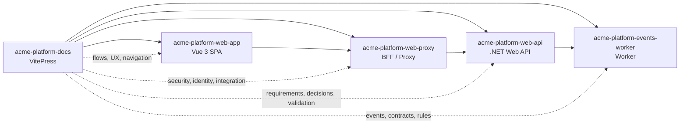

---
# https://vitepress.dev/reference/default-theme-home-page
layout: home

hero:
  name: "Flowsy DevGuide"
  text: "Design and Development of Software Solutions"
  tagline: Guidelines, Patterns and Best Practices
  image:
    src: /assets/img/flowsy-isotype-three-color.svg?v=transparent
    alt: Flowsy
  actions:
    - theme: brand
      text: AI-Assisted Development
      link: /ai-assisted-development/
    - theme: alt
      text: Discovery & Design
      link: /discovery/
    - theme: alt
      text: Technologies
      link: /technologies/

features:
  - icon: 🤖
    title: AI-Assisted Development
    details: Repository guidance for working with agents and skills using clear instructions, scoped permissions and verifiable outputs.
    link: /ai-assisted-development/
  - icon: ✅
    title: Automated Testing
    details: Testing as an early design and delivery practice, not a final implementation step, with unit, integration, end-to-end, database and event-driven system tests.
    link: /technologies/testing/
  - icon: 🧭
    title: Discovery & Design
    details: Collaborative modeling techniques with Event Storming and Domain-Driven Design to explore the domain and design solutions aligned with the business.
    link: /discovery/
  - icon: 📄
    title: Project Documentation
    details: Durable documentation practices for requirements, analysis, design records, repository instructions and traceable delivery artifacts.
    link: /discovery/documentation/
  - icon: 🧠
    title: Domain-Driven Design
    details: Pragmatic DDD principles and patterns for modeling complex domains, bounded contexts, entities, aggregates and value objects.
    link: /discovery/domain-driven-design
  - icon: 🌐
    title: Backend and APIs
    details: HTTP API design guidance, backend architecture patterns and C# implementation practices for clear contracts and maintainable services.
    link: /technologies/backend/api-design
  - icon: 🧩
    title: Frontend Vue
    details: Feature-set organization in Vue 3 with Composition API, Pinia, composables, Storybook and testing strategy for scalable SPA applications.
    link: /technologies/frontend/modular-architecture/concepts
  - icon: 🗄️
    title: Data and Migrations
    details: PostgreSQL schema management with versioned and repeatable scripts, domain-aligned SQL routines, Evolve, Flyway and flwdb tools.
    link: /technologies/backend/database-migrations/concepts
  - icon: 📨
    title: Events and Messaging
    details: Principles and patterns for asynchronous systems with Kafka, Redpanda and RabbitMQ, including Outbox, Saga, DLQ and observability.
    link: /technologies/backend/event-driven-architecture/concepts
---

::: tip Reference Guide, Not a Single Answer
`Flowsy DevGuide` gathers guidelines, patterns and recommendations to speed up technical decisions and keep shared criteria across projects, but it is not meant to be the final answer to every challenge a development team may face. Each project is still responsible for doing the research, analysis and design required by its domain, constraints, risks and goals.

Published Flowsy libraries, tools and templates follow the same principle: they are starting points that help with common development tasks, not complete catalogs of everything an application may need. When a specific need is not covered by those foundations, each team should design and implement the functionality, integration, validation or extension that its project requires.

This guide and its related libraries evolve through continuous study, experimentation and practical use. Treat them as a living reference, complement them with the team's technical judgment and validate every recommendation in the real context of the project.
:::

## Flowsy Ecosystem

Flowsy is an open source ecosystem focused on guides, libraries, tools, templates, conventions and reusable examples for designing and building software solutions. Its purpose is to provide a shared foundation that helps developers start projects with consistent criteria, reduce repetitive work and reuse patterns that are already documented or implemented.

This DevGuide works as the editorial and technical reference that explains how to use, adapt and complement those resources. Flowsy libraries and templates can serve as starting points for applications, services, documentation, testing, automation or cross-cutting components, but their adoption should always be evaluated against the real needs of each project.

For published libraries, templates and command-line tools, prefer the public package registries as the discovery and consumption point:

- [.NET packages and tools on NuGet](https://www.nuget.org/) for packages such as `Flowsy.Db.Unity`, `Flowsy.Mediation` and tools such as `Flowsy.Cli.Db` / `flwdb`;
- [JavaScript and TypeScript packages on NPM](https://www.npmjs.com/) when a Flowsy package or template is published for the Node ecosystem.

Before implementing generic functionality from scratch, it is worth reviewing the relevant registry to identify existing packages or tools that can be adopted, adapted or used as inspiration. When there is no suitable option, the project should design and implement the solution its context requires.

## Suggested Project Integration

The main documentation for each project should include an explicit reference to this guide, for example from `README.md`, `AGENTS.md`, `CLAUDE.md` or the technical onboarding document. This helps developers and AI agents share the same baseline for guidelines, patterns and conventions while working on the repository.

A practical recommendation is to add a short section like this:

```markdown
## Development Guide

This project uses `Flowsy DevGuide` as a reference for discovery,
architecture, conventions and AI-assisted development.

- Repository: `https://github.com/flowsydev/flowsy-devguide`
- Expected usage: work with a local clone of the guide added to the IDE workspace and keep it updated from `main`.
```

### Package and Repository Access

Flowsy resources are intended to be public and open source when possible, but repository and package access have different meanings:

- source repositories are available for reading, cloning, inspection, issue review and learning from examples;
- direct contribution to organization repositories is limited to users explicitly designated as collaborators or maintainers;
- community contributions should normally happen through the contribution workflow enabled for each repository, such as issues, discussions or pull requests from forks;
- published libraries, templates and command-line tools should be consumed from public registries such as NuGet and NPM;
- package publication is limited to explicitly authorized maintainers with the required registry permissions.

Use public package registries as the default source of truth for published artifacts:

- use NuGet for .NET libraries and tools such as `Flowsy.Db.Unity`, `Flowsy.Mediation` and `Flowsy.Cli.Db` / `flwdb`;
- use NPM for JavaScript, TypeScript or frontend packages and templates when they are published for the Node ecosystem;
- use source repositories for documentation, examples, source review, issue history and contribution context, not as the primary package installation source.

Suggested guidelines:

- Install published packages from their public registry whenever possible.
- Clone source repositories when you need to inspect implementation details, examples or contribution history.
- Do not assume write access to a repository because it is publicly readable.
- Contribute only through the workflow allowed by the repository, unless you have been explicitly added as a collaborator.
- Avoid pasting tokens, passwords or keys in prompts, versioned files, public documentation or project scripts.
- Configure credentials only when they are actually needed, such as for publishing packages, accessing private forks or working with release automation.
- Use credentials with the least privilege possible. When using a fine-grained GitHub Personal Access Token, limit access to the repositories, packages and permissions required for the task.
- Verify that development tools authenticate to NuGet, NPM, GitHub or any relevant registry only when publishing or consuming restricted packages.
- If an AI agent works inside the same workspace or container as the developer, make sure it can access only the repositories and packages needed for the assigned task.
- Keep local clones updated from the canonical branch to consult current documentation, templates and examples.

Even in public projects, safe access handling matters. Open source readability does not imply commit rights, release authority or package publication rights.

### Operational Recommendation

Besides linking this guide from the project's main documentation, make the intended consumption model explicit:

1. Clone `flowsy-devguide` in a local location accessible to the developer and AI agents.
2. Add that directory to the same IDE workspace where the project is being developed, even if it does not physically live inside the application repository.
3. Consult the local clone as a daily reference during analysis, design, implementation and review.
4. Sync the clone frequently from `main` to incorporate recent changes.
5. Use the relevant public registry as the canonical source for published package versions, and use GitHub for source history, documentation and contribution review.

This gives people and agents a reference that is always available inside the working environment, with fast search and navigation, while preserving traceability to the canonical published source.

## Typical Solution

This guide can be used as a cross-cutting reference in a solution composed of several specialized repositories. A practical way to adopt it is to maintain a project documentation site and several implementation repositories that share conventions, traceability and consistent use of `specs`.

In medium or large solutions, organize the documentation site by subdomains or related functional areas, and preserve separation by discipline when it adds clarity. Start simple and subdivide only when the volume of artifacts or the evolution of a topic justifies it.

Example of a typical solution:

```text
📁 acme-platform/
├── 📁 acme-platform-docs/                         <- VitePress documentation site
│   ├── 📁 .vitepress/
│   ├── 📁 catalog/                                <- product catalog and publishing subdomain
│   │   ├── 📁 analysis/
│   │   │   ├── 📄 CAT-ANL-NED-001-curated-product-catalog.md
│   │   │   └── 📄 CAT-ANL-REQ-001-product-availability-rules.md
│   │   ├── 📁 architecture/
│   │   │   └── 📄 CAT-ARC-ADR-001-search-indexing-strategy.md
│   │   └── 📁 validation/
│   │       └── 📄 CAT-VAL-AC-001-product-search-results.md
│   ├── 📁 checkout/                               <- carts, orders and payment orchestration
│   │   ├── 📁 analysis/
│   │   │   ├── 📄 CHK-ANL-NED-001-guest-checkout.md
│   │   │   └── 📄 CHK-ANL-BR-001-order-total-calculation.md
│   │   ├── 📁 delivery/
│   │   │   ├── 📄 CHK-DLV-EPC-001-checkout-flow.md
│   │   │   └── 📄 CHK-DLV-PBI-001-apply-discount-code.md
│   │   └── 📁 validation/
│   │       ├── 📄 CHK-VAL-AC-001-discount-application.md
│   │       └── 📄 CHK-VAL-GWT-001-payment-decline.md
│   ├── 📁 identity/                               <- sign-in, authorization and profile management
│   │   ├── 📁 analysis/
│   │   │   └── 📄 IDN-ANL-REQ-001-role-based-access.md
│   │   └── 📁 architecture/
│   │       └── 📄 IDN-ARC-ADR-001-token-based-session-model.md
│   ├── 📁 fulfillment/                            <- inventory, shipping and delivery tracking
│   │   ├── 📁 analysis/
│   │   │   └── 📄 FUL-ANL-REQ-001-shipment-status-tracking.md
│   │   ├── 📁 architecture/
│   │   │   └── 📄 FUL-ARC-CTR-001-shipment-events.md
│   │   └── 📁 delivery/
│   │       └── 📄 FUL-DLV-PBI-001-delivery-progress-page.md
│   ├── 📁 shared/
│   │   ├── 📁 strategy/
│   │   │   ├── 📄 SHR-STR-THM-001-operational-visibility.md
│   │   │   └── 📄 SHR-STR-INI-001-self-service-commerce.md
│   │   └── 📁 validation/
│   │       └── 📄 SHR-VAL-GWT-001-session-expiration.md
│   └── 📄 index.md
├── 📁 acme-platform-web-api/                      <- .NET Web API
│   ├── 📁 docs/
│   │   ├── 📁 adr/
│   │   ├── 📁 contracts/
│   │   └── 📁 specs/
│   │       ├── 📁 001-create-order-endpoint/
│   │       └── 📁 002-add-discount-validation/
│   ├── 📁 src/
│   └── 📁 tests/
├── 📁 acme-platform-web-app/                      <- Vue 3 SPA
│   ├── 📁 docs/
│   │   ├── 📁 architecture/
│   │   ├── 📁 testing/
│   │   └── 📁 specs/
│   │       ├── 📁 001-add-checkout-page/
│   │       └── 📁 002-protect-account-routes/
│   ├── 📁 src/
│   └── 📁 tests/
├── 📁 acme-platform-events-worker/                <- background worker for domain events
│   ├── 📁 docs/
│   │   ├── 📁 integrations/
│   │   ├── 📁 operations/
│   │   └── 📁 specs/
│   │       ├── 📁 001-consume-order-created/
│   │       └── 📁 002-publish-shipment-updated/
│   ├── 📁 src/
│   └── 📁 tests/
└── 📁 acme-platform-web-proxy/                    <- BFF or reverse proxy
    ├── 📁 docs/
    │   ├── 📁 operations/
    │   ├── 📁 security/
    │   └── 📁 specs/
    │       ├── 📁 001-enable-oidc-login/
    │       └── 📁 002-forward-api-token/
    ├── 📁 src/
    └── 📁 tests/
```

### Relationship Between Repositories



### How to Use This Guide

Each repository has a different responsibility, but can rely on this guide consistently:

- the documentation site concentrates discovery, requirements, architecture and validation artifacts with durable value, organized by subdomains or related areas when the volume requires it;
- implementation repositories use `docs/specs/` to plan and execute concrete changes with traceability;
- stable artifacts live in the project documentation; repository `specs` record how those changes are implemented;
- AI agents can use the documentation site as business and design context, and the repository `specs` as operational execution context.

> [!info] Note
> To learn the recommended structure for documenting `specs`, see [Specs-Driven Development](/ai-assisted-development/specs-driven-development).

### Continuous Research Before Design and Implementation

Set aside explicit time for research before designing and implementing functionality, especially when it involves security, integration, identity, events, compliance, performance or critical business processes.

The goal is to work with reliable and current information so the resulting solutions are more robust. Research before building reduces rework, avoids fragile decisions and improves the quality of the solutions that can later be accelerated with AI assistance.

This practice should not be limited to the beginning of a project. Apply it continuously, adjusting depth according to the complexity and criticality of each change.

- Small low-risk changes may require only a brief review of context and conventions.
- Critical changes may require deeper analysis, comparison of alternatives and validation of decisions before implementation.
- If the research produces knowledge with durable value, document it in the project site and reference it from the `specs` of the repositories involved.

### From Requirement to Implementation

A typical flow would be:

1. Document needs, requirements, rules, decisions and validation criteria in `acme-platform-docs`.
2. Create a `spec` in each involved repository when a feature enters implementation.
3. Translate project documentation into local analysis, plan, execution phases and validation.
4. Promote any durable decision that emerges during implementation back into the project documentation site.
5. Use each final `spec` summary to preserve continuity for humans and AI agents.

### Traceability Example

- `acme-platform-docs` documents the sign-in requirement, access flows and validation criteria.
- `acme-platform-web-proxy` implements login, session handling, identity-provider integration and route protection.
- `acme-platform-web-api` implements authorization, claim validation and protected business features.
- `acme-platform-web-app` implements authenticated navigation, route guards, session handling and user experience.
- `acme-platform-events-worker` implements asynchronous processing for order and fulfillment events.
- Each repository keeps its own `specs`, but all of them can link to the same requirement, architecture decision or contract defined in the documentation site.

In this model, project documentation acts as the shared source of truth and each repository's `specs` act as local execution units.
