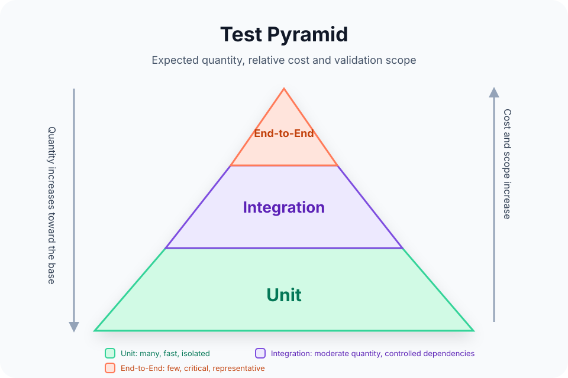

# Testing

Guides for designing, running and documenting automated tests in the reference stacks used by Flowsy projects.

## Test Pyramid

The pyramid does not mean one level is more important than another. It describes cost, scope and expected quantity: many unit tests for small rules, integration tests for relevant boundaries and a small number of end-to-end tests for critical flows.

## Recommended Path

1. Read [Automated Testing Strategy](./automated-testing.md) to decide what belongs at each level.
2. Open the test type you need:
   - [Unit Tests](./unit-tests.md)
   - [Integration Tests](./integration-tests.md)
   - [End-to-End Tests](./end-to-end-tests.md)
3. Review [Evidence and Reporting](./evidence-and-reporting.md) before closing a spec, PR or execution phase.
4. Apply the stack-specific guide:
   - [C#/.NET](./csharp-dotnet.md)
   - [TypeScript and Vue](./typescript-vue.md)
   - [PostgreSQL](./postgresql.md)
   - [Database Migrations](./database-migrations.md)
   - [Event-Driven Systems](./event-driven-systems.md)

## Quick Map

| Need | Page |
| --- | --- |
| Define the overall automated validation strategy | [Automated Testing Strategy](./automated-testing.md) |
| Validate isolated rules, functions, handlers, composables or stores | [Unit Tests](./unit-tests.md) |
| Validate collaboration with databases, HTTP, filesystem, messaging or controlled real dependencies | [Integration Tests](./integration-tests.md) |
| Validate complete flows from the user or external consumer perspective | [End-to-End Tests](./end-to-end-tests.md) |
| Record results in specs, CI or PRs without copying full logs | [Evidence and Reporting](./evidence-and-reporting.md) |

## Core Principle

Unit, integration and end-to-end tests have the same strategic importance, but not the same cost or purpose. A healthy suite uses each level for the risk it can detect best.
